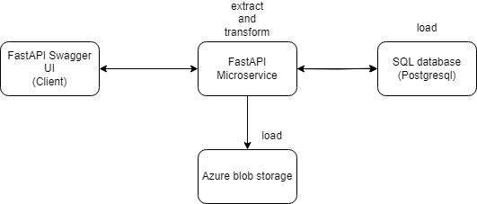

# ETL and REST API Project

## Overview
This project demonstrates a simple yet powerful ETL (Extract, Transform, Load) pipeline for ingesting CSV files into a postgres database. Additionally, a REST API is exposed to retrieve the recently ingested data.
Also, one or more files can be uploaded via another REST api and all the files are saved in azure blob storage.

  

### Features
- **ETL Pipeline:**
  - Ingests one or multiple CSV files into a flexible database
  - Applies basic transformations to load the data into the sql database.
  - Ensures reliable loading of data into the database:
  

  - Store the ingested files in azure blobstorage:
   

- **REST API:**
  - Provides a clean API for easy integration with other services.
  - Endpoint `/ingest/` sends one or more CSV files to the microservice:
  

  - Endpoint `/read/first-chunk` retrieves the first 10 lines from the database:
    

  - Delivers responses in JSON format for easy consumption:
    

- **Logging and Tracing:**
  - Robust logging throughout the ETL process and API requests using the loguru library.
  - Traceability to troubleshoot issues and monitor performance.

## Good Practices

### Exception Handling
- **Try-Except Blocks:**
  - Utilized throughout the code to handle exceptions gracefully.
  - Ensures the application doesn't crash and provides meaningful error messages.

### Design Patterns
- **Dependency Injector:**
  - Utilized [Dependency Injector](https://github.com/ets-labs/python-dependency-injector) to manage dependencies in a clean and modular way.
  - Enhances testability and maintainability by decoupling components.
  - Promotes a structured approach to dependency management, making the codebase more organized and readable.

- **Singleton Pattern:**
  - Implemented the singleton pattern in postgreSQL session instantiation.
  - Ensures only one instance of the class exists, promoting efficient resource utilization.

- **Factory Pattern:**
  - Applied the factory pattern in the service layer.
  - Encapsulates object creation, providing a clean interface and improving code maintainability.

### Type Hinting
- **Type Annotations:**
  - Used type hints across functions and methods.
  - Enhances code readability and provides better IDE support for developers.

### Docstring
- **Documentation Strings:**
  - Employed docstrings consistently in modules, classes, and functions.
  - Describes the purpose, parameters, and return values for better code understanding.

## Running the code 

    docker-compose up

## Technologies Used
- **Python 3:** Leveraging the power and simplicity of Python.
- **Database:** PostgreSQL - Utilizing PostgreSQL for efficient data storage.
- **ETL Library:** Pandas - Efficient data manipulation and transformation.
- **Database ORM:** SQLAlchemy - Object-Relational Mapping for Python and relational databases.
- **Web Framework:** FastAPI - Building a modern, fast (high-performance), web framework for building APIs.
- **Dependency Injection:** Dependency Injector - Implementing dependency injection for modular and testable code.
- **Docker:** Optional containerization for simplified deployment.
- **Azure Services:** 
  - Azure Identity - Authentication and authorization for Azure services.
  - Azure Storage Blob - Storing and retrieving data in Azure Blob Storage.

## Things to work on
- **tests:** add unit and integtaion tests
- **deployment:** deploy the application using kubernetes or azure
- **CRUDE:** add more endpoints to handle the data and avoid the duplication of the id
- **more exception handling:** handle the exceptions more and take into consideration all the corner cases
